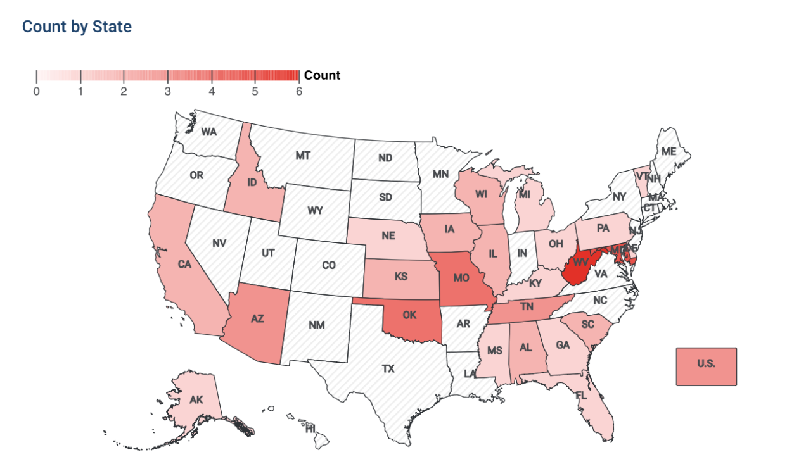
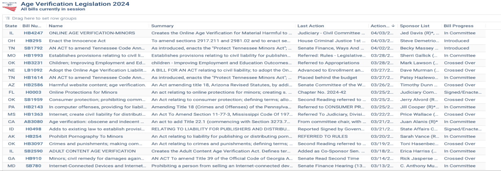
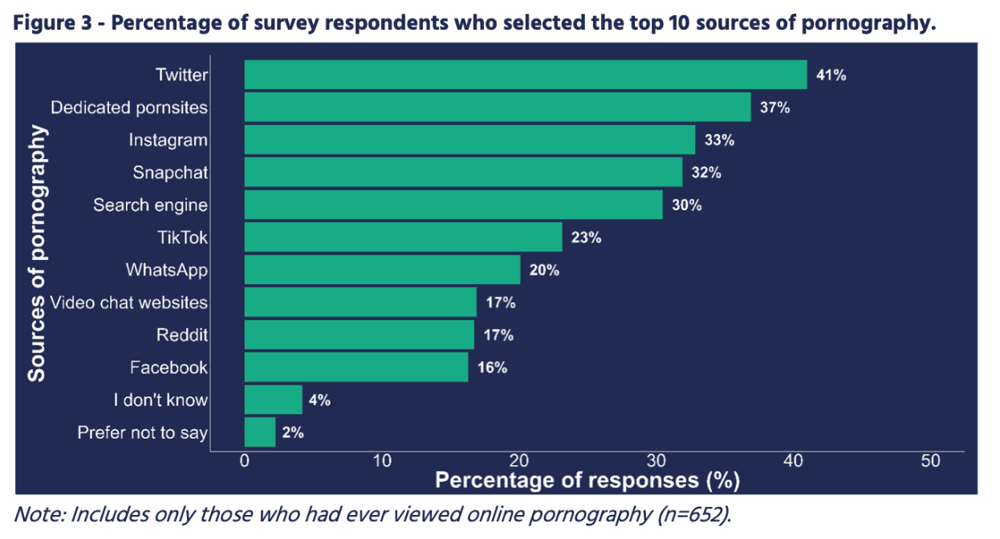
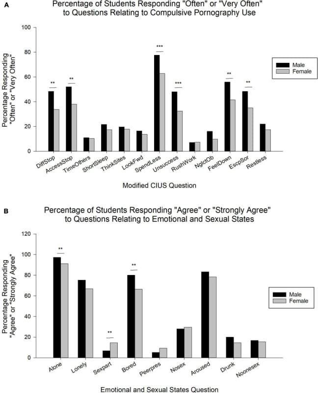
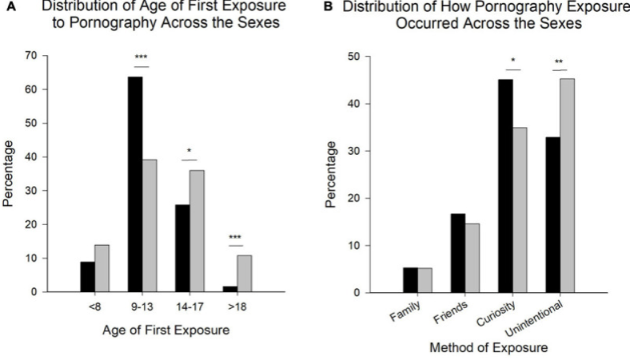
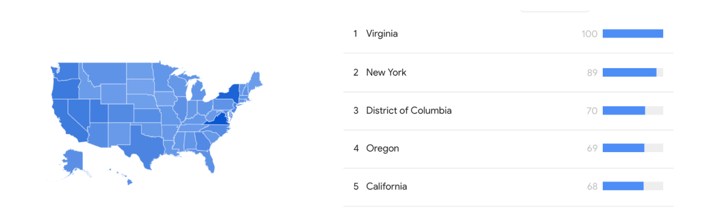

# Age Verification: An Analysis of its Effectiveness & Risks

Written by Alisa Gbiorczyk

Oct 31, 2024 • 10 min read

---

*This image was generated using Microsoft Copilot.*

Age verification mandates and laws were initially introduced to shield minors from exposure to content or products deemed inappropriate for their age, particularly in digital realms. These regulations aimed to restrict individuals below a specified age threshold from accessing material like explicit content or age-restricted products such as alcohol or tobacco. As we delve deeper into this subject, expect to navigate through a complex analysis, as I seek to stimulate your thoughts rather than impose conclusions. Today's discussion centers on age verification protocols implemented on pornography websites.

Let's clarify upfront: this discussion is not an attack on pornography nor child safety. This article only serves as a catalyst for action-oriented conversations and analyses of the advantages and disadvantages of age verification laws.

[*Age Verification Legislation 2024 | All bills currently in session*](https://www.billtrack50.com/public/stakeholderpage/mXTFqXqzjUm7leu3OeDKOg?ref=secjuice.com)

In January 2024, PornHub implemented access restrictions to its website in North Carolina and Montana in response to newly enacted laws in both states. These laws mandate that websites featuring explicit material must implement some form of age verification system to restrict access. It's worth noting that North Carolina and Montana are not the pioneers in implementing such legislation. There are [40 bills currently in progress in 2024](https://www.billtrack50.com/public/stakeholderpage/mXTFqXqzjUm7leu3OeDKOg?ref=secjuice.com) related to porn age verification, with West Virginia leading at 6 bills. 

[*Age Verification Legislation 2024| All bills currently in session*](https://www.billtrack50.com/public/stakeholderpage/mXTFqXqzjUm7leu3OeDKOg?ref=secjuice.com)

In the past, these mandates were seen as effective measures because they relied on traditional methods of verification, such as presenting identification cards or entering birth dates on websites. However, with the rapid advancement of technology and the increasing digital literacy among youth, these systems have become increasingly easy to circumvent.

### **AGE VERIFICATION LAWS EXPLAINED**

Since Texas is trending on this topic let's analyze the laws in detail. Websites hosting sexually explicit content are required to employ "reasonable age-verification methods'' to confirm that visitors from the state are 18 years old or older. These methods may involve requesting photos of government-issued identification or utilizing "a commercially reasonable method" that utilizes public or private transactional data to verify an individual's age. The law extends to any "commercial entity that knowingly and intentionally publishes or distributes material on an internet website, including a social media platform, more than one-third of which is sexual material harmful to minors." The purpose of the law being introduced is to implement processes that safeguard children from accessing harmful content. Dame Rachel De Souza has released a [report](https://www.childrenscommissioner.gov.uk/resource/pornography-and-harmful-sexual-behaviour/?ref=secjuice.com) shedding light on the impact of pornography on harmful sexual behavior among children. 

According to Dame Rachel, children are exposed to pornography at a distressingly young age, with the majority encountering it by the age of 13, and some even as young as eight or nine. Furthermore, the report highlights that most children first come across pornography on social media platforms. Dame Rachel emphasizes the urgent need for technology companies to take more proactive measures in removing such explicit content to protect young users from its harmful effects. 

[*Evidence on pornography’s influence on harmful sexual behaviour among children Published: 9 May 2023*](https://www.childrenscommissioner.gov.uk/resource/pornography-and-harmful-sexual-behaviour/?ref=secjuice.com)

Based on a [2020 study](https://pubmed.ncbi.nlm.nih.gov/33510691/?ref=secjuice.com) involving over 1,000 college students, the findings indicated that 17%, 20%, and 13.5% of students reported severe or extremely severe levels of depression, anxiety, and stress, respectively. Notably, compulsive pornography use was found to have a significant impact on all three mental health parameters. The study's conclusion highlighted a notable correlation between mental health issues and pornography use, including behaviors indicative of behavioral addictions.

[Front Psychol. 2020; 11: 613244.](https://www.ncbi.nlm.nih.gov/pmc/articles/PMC7835260/?ref=secjuice.com)

This underscores the importance of further investigation and acknowledgment of the potential impact of internet pornography on the negative mental health outcomes experienced by university students. There is a clear need for enhanced understanding and consideration of this relationship to develop effective strategies for addressing and mitigating the adverse effects of pornography consumption on mental well-being among this demographic.

[Front Psychol. 2020; 11: 613244.](https://www.ncbi.nlm.nih.gov/pmc/articles/PMC7835260/?ref=secjuice.com)

### **AGE VERIFICATION FLAWS**

The pressing issue at hand revolves around the lack of a foolproof age-verification system that meets the criteria of being non-intrusive, efficient, and easily deployable while ensuring comprehensive coverage and effectiveness. In the absence of established mechanisms to enforce these regulations, technology companies find themselves in a scramble to respond to these newly introduced laws. In their haste, there is a significant risk of unintended consequences. For instance, companies may inadvertently set up an Age Verification System (AVS) that lacks robust security measures due to a lack of understanding of how such systems function. This oversight could potentially compromise user privacy and security, leading to unintended breaches and vulnerabilities. And, of course, there is the troubling possibility that some companies may intentionally exploit the situation for their gain. They might resort to unethical practices, such as deliberately designing flawed age-verification systems to gather and exploit users' personal data for commercial purposes. This poses a grave threat to user privacy and raises concerns about data protection and online security.

Currently, the absence of a reliable and privacy-protective age estimation or verification process poses a significant challenge. Despite the increasing need for such systems, especially in digital environments, there hasn't been a solution that effectively meets all requirements. France's National Commission on Informatics and Liberty (CNIL) delved into this issue, conducting a thorough examination of existing age verification methods. The [CNIL's analysis](https://www.cnil.fr/en/online-age-verification-balancing-privacy-and-protection-minors?ref=secjuice.com) revealed that none of the currently available methods fulfilled three fundamental criteria: reliable verification, comprehensive coverage of the entire population, and strict adherence to individuals' data protection, privacy, and security. This means that regardless of the method employed, whether it involves identification checks, online forms, or other means, there are inherent flaws that compromise its effectiveness and privacy protections. The implications of this shortfall are significant. Without a robust age verification system, there's a heightened risk of minors accessing age-inappropriate content or products online while raising concerns about data privacy and security breaches. Moreover, regulatory efforts aimed at mandating age verification measures may face challenges in implementation and enforcement due to the lack of suitable solutions.

Unfortunately, the current legislation lacks clarity regarding the specific measures websites must adopt to mitigate these risks effectively. Biometric data, including facial recognition or fingerprint scans, can be particularly intrusive, as it provides unique identifiers linked directly to individuals. Without clear guidelines on how this data will be handled, stored, and protected, there's a heightened risk of unauthorized access, data breaches, and potential misuse by third parties. The reliance on automated age estimation algorithms introduces the risk of erroneous blocking, where children and adults could be unjustly denied access to content due to inaccuracies in age estimation. This not only undermines individuals' access to information and services but also raises concerns about censorship and discriminatory practices. I am also interested in knowing the levels of transparency regarding the algorithms and methodologies used in these age estimation systems, making it challenging for users to understand how their age is determined and whether they can contest erroneous determinations effectively.

### **CONSEQUENCES: CYBER CRIME**

This sets the stage for a nightmare scenario, particularly benefiting illicit actors operating beyond legal boundaries. According to a study conducted by the European Policy Information Center (EPICENTER) and the Institute of Economic Affairs (IEA), mandatory age verification measures have the potential to substantially augment the volume of sensitive data retained by third-party entities and the frequency of its collection. This heightened accumulation of personal information exposes users to heightened risks of privacy infringements and exploitation.

We should be prepared and anticipate a surge in such criminal activities, with users falling victim to these scams at an alarming rate. The heightened demand for age verification may inadvertently create an environment ripe for exploitation by malicious actors, further exacerbating the risks faced by unsuspecting individuals. By coercing websites into collecting extensive personal data from users, it inadvertently creates a treasure trove for hackers. These malicious individuals can exploit vulnerabilities in website databases, amassing stolen private information and peddling it to identity thieves lurking in the darkest corners of the internet. Consider the implications: if a widely-used platform like Pornhub is mandated to gather passports and driver's licenses from every visitor, it consolidates millions of individuals' sensitive IDs into one vulnerable repository. This centralized database becomes an irresistible target for hackers, offering a single entry point to pilfer vast amounts of personal information in one fell swoop.

For example there have been disturbing reports emerging from Louisiana, indicating a rise in potential cases of identity theft. Criminals are exploiting the situation by orchestrating phishing scams, masquerading as adult websites and deceiving users into submitting sensitive identification documents. 

### **IT’S NOT BULLET PROOF**

The sole method for a website to ascertain a user's location within a specific state is by utilizing the geolocation data furnished by the user's device. However, it is relatively straightforward for individuals to circumvent location-based restrictions by employing a Virtual Private Network (VPN), thereby masking their true location and bypassing age verification checks.

In the past year, based on data from Google Search Trends, Virginia has emerged as the leading state in terms of searches for terms such as "VPN" or "virtual private network." 

*Google Search Trends (USA/ 12 Months)*

In certain instances, we observe that internet-savvy users actively seek ways to circumvent barriers placed upon them. They employ various tools and methods available online to navigate the internet according to their preferences. Therefore, it's not uncommon for individuals to adapt and find solutions when faced with new obstacles. For example, when confronted with restrictions or limitations, users may turn to technologies like VPNs (Virtual Private Networks) or proxy servers to bypass geographical or content-based blocks. These tools allow users to anonymize their online activities and access content that may otherwise be restricted or censored. This phenomenon underscores the dynamic nature of the internet, where barriers and restrictions often prompt the emergence of innovative solutions. It highlights the resilience and adaptability of internet users in finding ways to maintain their online freedom and access information and services without undue hindrance.

### **THE YOUNGER GENERATION HAS A MASTER KEY**

Protecting our youth is critical and important, and we have a right to live safely from harm. However, I can’t help but point out some key foundational flaws in this regulatory strategy. Present-day youth possess a remarkable ability to deceive online service providers into believing they are located elsewhere. Virtual Private Networks (VPNs), for instance, are readily accessible and user-friendly tools that facilitate this deception. Many individuals, including minors, employ VPNs for legitimate purposes, such as accessing content from different regions on platforms like Netflix. These tools, such as VPNs, enable users to bypass websites' verification measures effortlessly.

Consequently, implementing widespread age verification requirements across the internet will inadvertently amplify the prevalence of such tools. Ironically, policymakers' insistence on mandating identity verification online could paradoxically result in the internet becoming even more anonymous.In essence, while the intention may be to bolster online safety and security, the unintended consequence could be the opposite.

In fact, I do not remember a time when the Internet did not exist. Children and young adults simply possess a deep understanding of digital platforms, software, and online tools. They are adept at finding loopholes or workarounds to bypass age verification measures. For instance, they may use fake identification or employ various online tricks to falsify their age when accessing restricted content or making age-restricted purchases. This may frustrate a large majority of people, but if it wasn't to be accessed, they would find ways to do so. The only group that has a large smile on their face right now is the VPN industry. 

*   **A** [**study in 2021**](https://doi.org/10.1162/ba67f642.646d0673?ref=secjuice.com) **found that out of youth aged 11-14 years old, 41% had knowledge of and leveraged VPNs.**
*   **According to a** [**2019 study**](https://www.gwi.com/reports/vpn-usage-around-the-world?ref=secjuice.com)**, the majority of VPN users (68%) are younger users (16-34 years old).**
*   **According to demographic data from** [**GlobalWebIndex on VPN usage**](https://dataprot.net/statistics/vpn-statistics/?ref=secjuice.com)**, around 75% of users are under the age of 37, highlighting the necessity for older generations to familiarize themselves with this technology. The statistics also reveal that approximately 25% of VPN users globally fall within the 38-55 age bracket, with 16% being over 55 years old. It also reveals that roughly three-quarters, or 75%, of all users are under the age of 37.**

In addition to VPNs, which serve as one alternative for accessing pornographic content on the internet, the existence of other avenues that individuals may exploit. Chat applications, social media platforms, and other areas of the internet still leave a huge gap of harmful content reaching minors. Circumventing legal restrictions is not solely reliant on technical methods; there are various alternative routes through which individuals, including minors, may encounter explicit content online. Implementation of mandatory age verification measures might inadvertently incentivize users to seek out less regulated and less secure online platforms. This potential shift in user behavior could exacerbate the existing risks associated with privacy breaches and exploitation. As individuals navigate towards alternative platforms with laxer verification protocols, they expose themselves to heightened vulnerabilities, including the potential for unauthorized data access and misuse by malicious actors. Thus, while the intention behind age verification mandates may be to enhance online safety, their unintended consequences could lead to a fragmentation of user traffic across less secure digital spaces, ultimately posing greater challenges in safeguarding user privacy and security on the internet.

This underscores the complexity of addressing the issue effectively. In addition, it is important to note that many pornographic websites operate outside the jurisdiction of the United States. As a result, legal measures implemented within the country may have a limited impact on regulating or curbing access to such content globally. This international dimension further complicates efforts to address the proliferation of pornographic material on the internet.

As a result, while age verification mandates and laws may have been a viable solution in the past, they now face significant challenges in effectively preventing minors from accessing age-restricted content or products online. Policymakers and regulators must recognize the limitations of traditional age verification methods and explore alternative approaches, such as more robust technological solutions or comprehensive education and awareness programs, to address the evolving landscape of digital access and youth protection.

_Below is an alternate blog post image._

*This image was created by Midjourney.*

## Help Support Our Non-Profit Mission

If you enjoyed this article or found it helpful please consider making a **U.S. tax-deductible** donation, Secjuice is a non-profit and volunteer-based publication powered by donations. We will use your donation to help cover our hosting costs and **keep Secjuice an advertisement and sponsor free zone**.

[Make a tax-deductible donation](https://opencollective.com/secjuice)