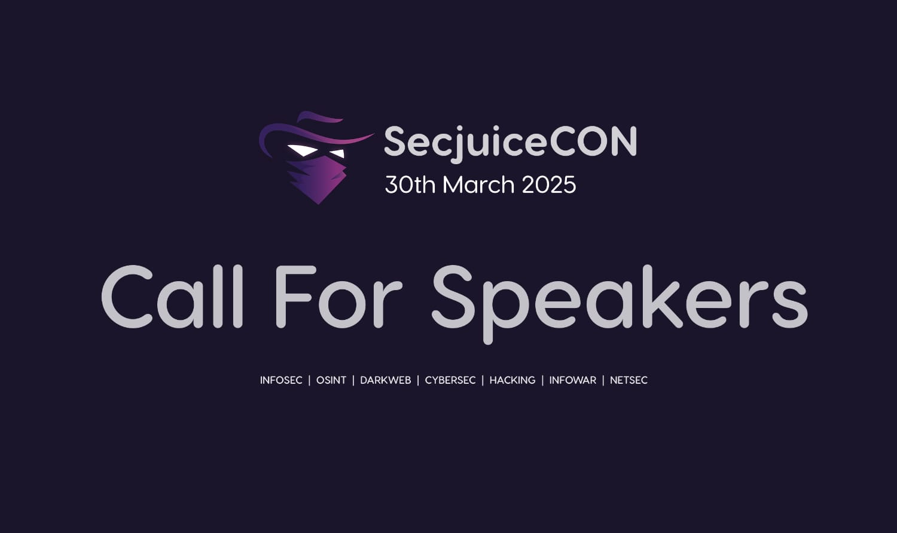

# SecjuiceCON 2025

Written by Secjuice

Oct 31, 2024 • 1 min read

---

After a decade of publishing your favorite infosec articles, we are very proud to announce SecjuiceCON 2025, our very first virtual conference. The first Secjuice conference is an online event for infosec and osint industry insiders, and we'd love for you to talk to our audience about your wisdom and learnings.

You might already know about our work, but Secjuice is the only [non-profit, independent, and volunteer-led publication](https://www.secjuice.com/about-us/) in the information security space. We are a private members' writing club focused on cybersecurity, information security, hacking, and open-source intelligence gathering.

We believe that our value as professionals lies in our ability to share our research and knowledge with others through the written word. We mentor hackers and help them prepare their research for publication. Our members feel a strong sense of civic duty; it's what drives us to spread our knowledge and experiences with our community. Defending the interests of those who hack is [within our remit](https://www.secjuice.com/about-us/).

### Conference Date

**Mark it in your calendar:** Sunday, March 30, 2025

### Venue

Online: Registration information will become available in Q1 2025.

### Topics

SecjuiceCON will cover the following topics and welcome speaker applications around these topics on any subject:

*   Deep Technical Vibes
*   Penetration Testing Pro's
*   The Art of Security Research
*   The Dirty Dark Web
*   Open-Source Intelligence (OSINT) Technology
*   Open-Source Intelligence (OSINT) Methodology
*   How Laws and Regulations Annoy You
*   Ethics & Best Practices In What We Do
*   Surprise Us With Insanity!

### Code Of Conduct

No drama, no hostility, maintain civility, or else.

### Call for Presenters

Please visit [https://sessionize.com/SecjuiceCon2025/](https://sessionize.com/SecjuiceCon2025/?ref=secjuice.com) to submit an abstract.

The deadline to submit is **12/31/2024**.

### Our Sponsors

We thank the following sponsors:

*   [Sessionize](https://sessionize.com/?ref=secjuice.com)

### Want to sponsor SecjuiceCon?

Please email `conference` `at` `secjuice` `dot` `com` to get more details!!

## Help Support Our Non-Profit Mission

If you enjoyed this article or found it helpful please consider making a **U.S. tax-deductible** donation, Secjuice is a non-profit and volunteer-based publication powered by donations. We will use your donation to help cover our hosting costs and **keep Secjuice an advertisement and sponsor free zone**.

[Make a tax-deductible donation](https://opencollective.com/secjuice)
